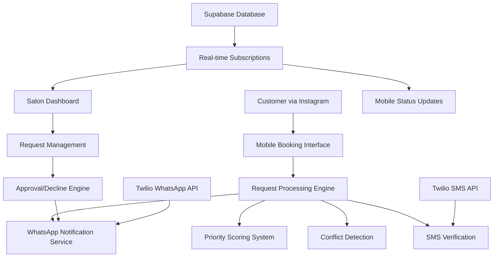
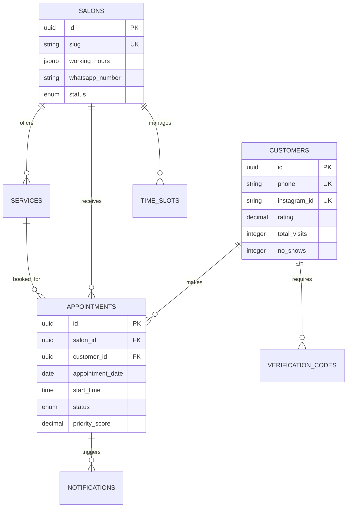

# Design Document - Core Booking Workflow

## Overview

The core booking workflow system is the central feature of ImiRezervimi.al that enables seamless appointment booking between Albanian beauty salon customers and salon owners. The system transforms the chaotic Instagram DM-based booking process into a structured, priority-driven workflow with WhatsApp notifications.

The architecture follows a request-approval pattern where customers submit appointment requests through mobile-optimized booking pages accessed via Instagram bio links, and salon owners manage these requests through a dashboard with automatic WhatsApp notifications throughout the process.

## Architecture

### High-Level System Architecture



### Technology Stack

- **Frontend**: Next.js 15 with TypeScript, Tailwind CSS
- **Backend**: Next.js API routes, Supabase Edge Functions
- **Database**: PostgreSQL (Supabase) with Row Level Security
- **Authentication**: NextAuth.js with Instagram/Google OAuth + SMS verification
- **Real-time**: Supabase real-time subscriptions
- **Notifications**: Twilio WhatsApp Business API + SMS
- **Hosting**: Vercel (frontend), Supabase (backend/database)

## Components and Interfaces

### 1. Customer Booking Interface

**Purpose**: Mobile-first booking experience accessed through Instagram bio links

**Key Components**:
- **Salon Profile Display**: Shows salon info, services, and availability
- **Service Selection**: Grid-based service picker with pricing and duration
- **Time Slot Calendar**: Mobile-optimized date/time picker
- **Customer Information Form**: Name, phone with Albanian validation
- **SMS Verification**: 6-digit code verification for new customers
- **Request Confirmation**: Albanian success message with tracking info

**Technical Implementation**:
```typescript
// Core booking interface structure
interface BookingRequest {
  salonId: string;
  serviceId: string;
  customerId?: string; // null for new customers
  appointmentDate: string;
  startTime: string;
  customerInfo: {
    firstName: string;
    lastName: string;
    phone: string; // +355 format
  };
  customerNotes?: string;
}

// Booking flow state management
interface BookingState {
  step: 'service' | 'time' | 'info' | 'verify' | 'confirm';
  selectedService: Service | null;
  selectedDateTime: DateTime | null;
  customerInfo: CustomerInfo | null;
  verificationCode?: string;
  isSubmitting: boolean;
  error?: string;
}
```

### 2. Salon Dashboard

**Purpose**: Centralized request management for salon owners

**Key Components**:
- **Request Queue**: Priority-sorted list of pending requests
- **Customer Details Panel**: Shows customer history, rating, priority score
- **Quick Actions**: Approve/Decline buttons with one-click actions
- **Calendar View**: Daily/weekly appointment overview
- **Time Slot Management**: Block/unblock availability
- **Customer Rating System**: Post-appointment rating interface

**Technical Implementation**:
```typescript
// Dashboard data structure
interface DashboardData {
  pendingRequests: AppointmentRequest[];
  todaysAppointments: Appointment[];
  upcomingAppointments: Appointment[];
  blockedTimeSlots: TimeSlot[];
  salonStats: {
    totalRequests: number;
    approvalRate: number;
    averageResponseTime: number;
  };
}

// Real-time subscription for live updates
const subscription = supabase
  .channel('salon-requests')
  .on('postgres_changes', {
    event: 'INSERT',
    schema: 'public',
    table: 'appointments',
    filter: `salon_id=eq.${salonId}`
  }, handleNewRequest)
  .subscribe();
```

### 3. Priority Scoring Engine

**Purpose**: Automatically prioritize customer requests based on value and history

**Algorithm**:
```typescript
function calculatePriorityScore(customer: Customer, servicePrice: number): number {
  const ratingScore = (customer.rating || 0) * 20; // 0-100 points
  const visitScore = Math.min(customer.totalVisits, 10) * 2; // 0-20 points
  const revenueScore = servicePrice * 0.5; // Variable points
  const reliabilityBonus = customer.cancellationRate < 0.1 ? 10 : 0; // 0-10 points
  
  return Math.min(ratingScore + visitScore + revenueScore + reliabilityBonus, 100);
}
```

**Priority Categories**:
- **VIP (80-100)**: High-value repeat customers
- **Regular (50-79)**: Standard customers with good history
- **New (40-59)**: First-time customers
- **Risk (0-39)**: Customers with poor history

### 4. WhatsApp Notification System

**Purpose**: Automated Albanian-language notifications throughout booking lifecycle

**Message Templates**:
```typescript
const messageTemplates = {
  requestSent: (salon: string, date: string, time: string) => 
    `Kërkesa u dërgua te ${salon} për ${date} në ${time}. Do të njoftoheni brenda 2 orësh! 💅`,
  
  requestApproved: (salon: string, date: string, time: string) => 
    `imirezervimii u bë me sukses! ${salon} ju mirëpret ${date} në ${time}! ✨`,
  
  requestDeclined: (salon: string, reason?: string) => 
    `Na vjen keq, ${salon} nuk mund të ju pranojë këtë herë. ${reason || 'Provoni një kohë tjetër!'} 🙏`,
  
  reminder24h: (salon: string, date: string, time: string) => 
    `Kujtesë: Nesër në ${time} te ${salon}. Shihemi atje! 💅`,
  
  newRequestForSalon: (customer: string, service: string, date: string, time: string) => 
    `Kërkesë e re nga ${customer} për ${service} - ${date} në ${time}. Shikoni dashboard-in tuaj! 📱`
};
```

**Delivery Logic**:
- **Immediate**: New request notifications to salon
- **Within 2 hours**: Customer confirmation/decline
- **24 hours before**: Appointment reminders
- **Retry mechanism**: 3 attempts with exponential backoff

### 5. Time Slot Management System

**Purpose**: Prevent double-bookings and manage salon availability

**Availability Calculation**:
```typescript
interface TimeSlot {
  date: string;
  startTime: string;
  duration: number;
  status: 'available' | 'booked' | 'blocked';
  blockReason?: string;
}

function generateAvailableSlots(
  salon: Salon, 
  date: string, 
  serviceDuration: number
): TimeSlot[] {
  const workingHours = salon.workingHours[getDayOfWeek(date)];
  if (workingHours.closed) return [];
  
  const slots: TimeSlot[] = [];
  const startTime = parseTime(workingHours.open);
  const endTime = parseTime(workingHours.close);
  
  // Generate 30-minute slots within working hours
  for (let time = startTime; time < endTime; time += 30) {
    if (!hasConflict(salon.id, date, time, serviceDuration)) {
      slots.push({
        date,
        startTime: formatTime(time),
        duration: serviceDuration,
        status: 'available'
      });
    }
  }
  
  return slots;
}
```

### 6. SMS Verification System

**Purpose**: Anti-spam protection and customer verification

**Verification Flow**:
1. Generate 6-digit code with 10-minute expiry
2. Send via Twilio SMS to Albanian phone numbers
3. Allow 3 verification attempts
4. Rate limit: 1 code per minute per phone number
5. Store verification status for future bookings

```typescript
interface VerificationCode {
  phone: string;
  code: string;
  expiresAt: Date;
  attempts: number;
  verified: boolean;
}

async function sendVerificationCode(phone: string): Promise<void> {
  const code = generateSixDigitCode();
  const message = `Kodi juaj i verifikimit për ImiRezervimi.al: ${code}. Kodi skadon në 10 minuta.`;
  
  await twilioClient.messages.create({
    body: message,
    from: process.env.TWILIO_PHONE_NUMBER,
    to: phone
  });
  
  await saveVerificationCode({ phone, code, expiresAt: new Date(Date.now() + 10 * 60 * 1000) });
}
```

## Data Models

### Core Entities

```typescript
// Customer entity
interface Customer {
  id: string;
  firstName: string;
  lastName: string;
  phone: string;
  email?: string;
  instagramId?: string;
  googleId?: string;
  rating: number; // 0-5 stars
  totalVisits: number;
  noShows: number;
  cancellationRate: number;
  accountType: 'guest' | 'social' | 'verified';
  isActive: boolean;
  createdAt: Date;
}

// Salon entity
interface Salon {
  id: string;
  name: string;
  slug: string; // for bio links
  description: string;
  phone: string;
  address: string;
  city: string;
  instagramHandle: string;
  workingHours: WorkingHours;
  whatsappNumber: string;
  subscriptionTier: 'free' | 'basic' | 'premium';
  trialEndsAt: Date;
  status: 'active' | 'inactive' | 'pending';
}

// Appointment entity
interface Appointment {
  id: string;
  salonId: string;
  customerId: string;
  serviceId: string;
  appointmentDate: string;
  startTime: string;
  duration: number;
  serviceName: string;
  servicePrice: number;
  status: 'pending' | 'approved' | 'declined' | 'completed' | 'no_show' | 'cancelled';
  priorityScore: number;
  customerNotes?: string;
  salonNotes?: string;
  requestedAt: Date;
  respondedAt?: Date;
}
```

### Database Relationships



## Error Handling

### Client-Side Error Handling

```typescript
// Booking form error states
interface BookingErrors {
  service?: string;
  dateTime?: string;
  customerInfo?: {
    firstName?: string;
    lastName?: string;
    phone?: string;
  };
  verification?: string;
  submission?: string;
}

// Error message mapping in Albanian
const errorMessages = {
  INVALID_PHONE: 'Numri i telefonit duhet të jetë në formatin +355XXXXXXXX',
  SLOT_UNAVAILABLE: 'Kjo orë nuk është më e disponueshme. Zgjidhni një tjetër.',
  VERIFICATION_FAILED: 'Kodi i verifikimit është i gabuar ose ka skaduar.',
  NETWORK_ERROR: 'Problem me lidhjen. Provoni përsëri.',
  RATE_LIMITED: 'Shumë kërkesa. Prisni 1 minutë para se të provoni përsëri.',
  SALON_CLOSED: 'Saloni është i mbyllur në këtë datë.',
  MAX_PENDING: 'Keni arritur limitin e kërkesave në pritje (2 maksimum).'
};
```

### Server-Side Error Handling

```typescript
// API error response structure
interface APIError {
  code: string;
  message: string;
  details?: any;
  timestamp: Date;
}

// Error handling middleware
async function handleBookingRequest(req: NextApiRequest, res: NextApiResponse) {
  try {
    // Validation
    const validation = validateBookingRequest(req.body);
    if (!validation.valid) {
      return res.status(400).json({
        code: 'VALIDATION_ERROR',
        message: 'Invalid request data',
        details: validation.errors
      });
    }
    
    // Business logic checks
    const conflicts = await checkTimeSlotConflicts(req.body);
    if (conflicts.length > 0) {
      return res.status(409).json({
        code: 'SLOT_CONFLICT',
        message: 'Time slot no longer available'
      });
    }
    
    // Process request
    const appointment = await createAppointmentRequest(req.body);
    res.status(201).json(appointment);
    
  } catch (error) {
    console.error('Booking request error:', error);
    res.status(500).json({
      code: 'INTERNAL_ERROR',
      message: 'Something went wrong. Please try again.'
    });
  }
}
```

### WhatsApp Delivery Error Handling

```typescript
// WhatsApp message delivery with retry logic
async function sendWhatsAppMessage(
  phone: string, 
  message: string, 
  retryCount = 0
): Promise<void> {
  try {
    const result = await twilioClient.messages.create({
      body: message,
      from: 'whatsapp:' + process.env.TWILIO_WHATSAPP_NUMBER,
      to: 'whatsapp:' + phone
    });
    
    // Log successful delivery
    await logNotification({
      phone,
      message,
      twilioSid: result.sid,
      status: 'sent'
    });
    
  } catch (error) {
    if (retryCount < 3) {
      // Exponential backoff retry
      const delay = Math.pow(2, retryCount) * 1000;
      setTimeout(() => {
        sendWhatsAppMessage(phone, message, retryCount + 1);
      }, delay);
    } else {
      // Log failed delivery after all retries
      await logNotification({
        phone,
        message,
        status: 'failed',
        error: error.message
      });
    }
  }
}
```

## Testing Strategy

### Unit Testing

**Frontend Components**:
- Booking form validation logic
- Time slot calculation functions
- Priority score calculation
- Albanian text formatting utilities

**Backend APIs**:
- Appointment request processing
- Conflict detection algorithms
- WhatsApp message formatting
- SMS verification logic

### Integration Testing

**End-to-End Booking Flow**:
1. Customer accesses salon booking page
2. Selects service and time slot
3. Enters personal information
4. Completes SMS verification
5. Submits appointment request
6. Salon receives WhatsApp notification
7. Salon approves/declines request
8. Customer receives confirmation

**WhatsApp Integration**:
- Message delivery testing with test phone numbers
- Albanian character encoding verification
- Retry mechanism validation
- Delivery status tracking

### Performance Testing

**Load Testing Scenarios**:
- Multiple simultaneous booking requests for same time slot
- High volume of SMS verification requests
- Dashboard real-time updates under load
- WhatsApp API rate limiting behavior

**Mobile Performance**:
- 3G network loading times
- Instagram in-app browser compatibility
- Touch interaction responsiveness
- Form submission on slow connections

### Security Testing

**Authentication & Authorization**:
- Instagram OAuth flow security
- SMS verification bypass attempts
- Customer data access controls
- Salon dashboard unauthorized access

**Anti-Spam Measures**:
- Rate limiting effectiveness
- Phone number validation bypass
- Duplicate request prevention
- Suspicious pattern detection

## Performance Considerations

### Database Optimization

```sql
-- Critical indexes for booking performance
CREATE INDEX CONCURRENTLY idx_appointments_salon_date_priority 
ON appointments(salon_id, appointment_date, priority_score DESC);

CREATE INDEX CONCURRENTLY idx_time_slots_availability 
ON time_slots(salon_id, date, start_time) 
WHERE status = 'available';

-- Partitioning for large appointment tables
CREATE TABLE appointments_2025 PARTITION OF appointments
FOR VALUES FROM ('2025-01-01') TO ('2026-01-01');
```

### Caching Strategy

```typescript
// Redis caching for frequently accessed data
const cacheKeys = {
  salonAvailability: (salonId: string, date: string) => `availability:${salonId}:${date}`,
  customerPriority: (customerId: string) => `priority:${customerId}`,
  salonWorkingHours: (salonId: string) => `hours:${salonId}`
};

// Cache salon availability for 5 minutes
async function getCachedAvailability(salonId: string, date: string) {
  const cacheKey = cacheKeys.salonAvailability(salonId, date);
  const cached = await redis.get(cacheKey);
  
  if (cached) return JSON.parse(cached);
  
  const availability = await calculateAvailability(salonId, date);
  await redis.setex(cacheKey, 300, JSON.stringify(availability));
  
  return availability;
}
```

### Real-time Performance

```typescript
// Optimized real-time subscriptions
const subscription = supabase
  .channel(`salon-${salonId}`)
  .on('postgres_changes', {
    event: 'INSERT',
    schema: 'public',
    table: 'appointments',
    filter: `salon_id=eq.${salonId} AND status=eq.pending`
  }, (payload) => {
    // Only update UI for pending requests to reduce noise
    updateDashboard(payload.new);
  })
  .subscribe();
```

## Security Measures

### Data Protection

- **Encryption**: All PII encrypted at rest using Supabase encryption
- **Phone Number Masking**: Display only last 4 digits in admin interfaces
- **GDPR Compliance**: 30-day data deletion on account closure
- **Row Level Security**: Database-level access controls

### API Security

```typescript
// Rate limiting middleware
const rateLimiter = rateLimit({
  windowMs: 60 * 1000, // 1 minute
  max: 10, // 10 requests per minute per IP
  message: 'Shumë kërkesa. Provoni përsëri pas 1 minute.',
  standardHeaders: true,
  legacyHeaders: false
});

// Input validation
const bookingSchema = z.object({
  salonId: z.string().uuid(),
  serviceId: z.string().uuid(),
  appointmentDate: z.string().regex(/^\d{4}-\d{2}-\d{2}$/),
  startTime: z.string().regex(/^\d{2}:\d{2}$/),
  customerInfo: z.object({
    firstName: z.string().min(2).max(50),
    lastName: z.string().min(2).max(50),
    phone: z.string().regex(/^\+355[0-9]{8,9}$/)
  })
});
```

### Anti-Spam Protection

- **Phone Verification**: Required for all new customers
- **Rate Limiting**: 1 request per minute, max 2 pending per customer
- **IP Blocking**: Automatic blocking for suspicious patterns
- **Honeypot Fields**: Hidden form fields to catch bots

This design provides a robust, scalable foundation for the core booking workflow that handles the unique requirements of the Albanian beauty salon market while maintaining excellent user experience and operational efficiency.